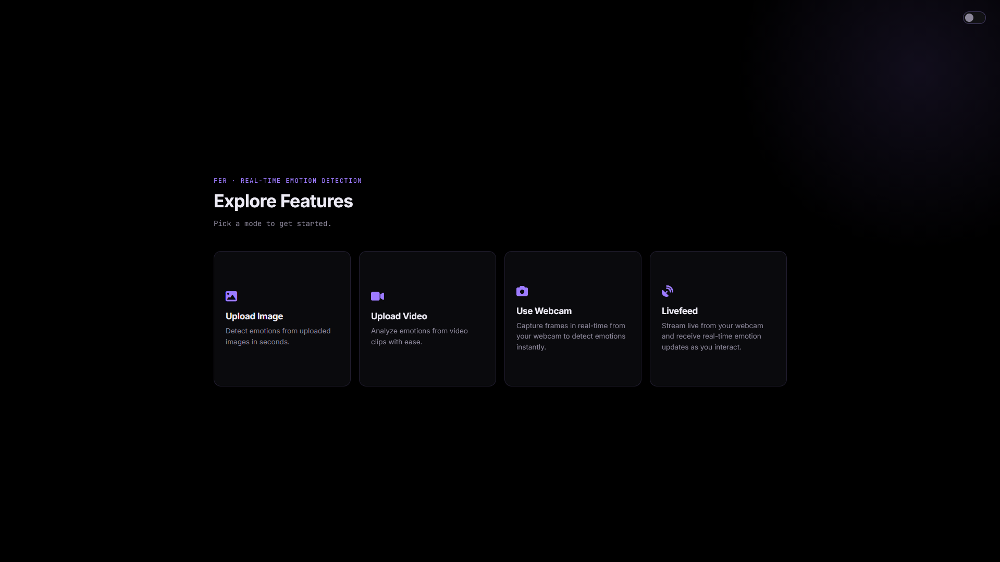

<p align="center">
  
</p>

<h1 align="center">Emotion-Detection-App</h1>

<p align="center">
  
</p>

<p align="center"><strong>Real-time facial emotion recognition pipeline</strong></p>
<p align="center">
  A web-based Flask application utilizing a trained Convolutional Neural Network (CNN) to detect and classify human emotions frame-by-frame via image, video, and live webcam feeds.
</p>

<p align="center">
  
  
  
  
</p>

---

## ✨ Features

* **Multi-Format Processing:** Detect emotions in static images, analyze uploaded videos frame-by-frame, or stream real-time facial recognition via webcam.
* **Deep Learning Core:** A lightweight, residual depthwise-separable CNN (~58K parameters) classifying seven emotional states (Angry, Disgust, Fear, Happy, Sad, Surprise, Neutral), sized for real-time inference.
* **Local Web Dashboard:** A Flask-based control interface serving an AMOLED-dark HTML/CSS/JS frontend for media uploading and live feed rendering.
* **Containerized Deployment:** Fully Dockerized architecture for isolated, reproducible environments.

## ⚙️ How It Works

```text
┌───────────────────────┐
│   Input Source        │
│ (Image/Video/Webcam)  │
└───────────┬───────────┘
            │  Upload / Stream
            ▼
┌───────────────────────┐
│   Face Detection      │
│ (Haar Cascade XML)    │
└───────────┬───────────┘
            │  Extract facial ROI
            ▼
┌───────────────────────┐
│  CNN Emotion Model    │
│ (model.h5 / JSON)     │
└───────────┬───────────┘
            │  Classify expression
            ▼
┌───────────────────────┐
│   Flask Dashboard     │
│   (Live Rendering)    │
└───────────────────────┘
```
## 🧠 Model

`Main.py` trains a lightweight residual depthwise-separable CNN (mini-Xception family) — 48×48 grayscale input, ~58K parameters, sized for real-time inference rather than raw accuracy.

**Training recipe:**
* Standard FER2013 `Training` / `PublicTest` / `PrivateTest` splits, used as train / validation / held-out test respectively.
* Optional [FERPlus](https://github.com/microsoft/FERPlus) label support (`--ferplus-path`) — same images, majority-vote labels from 10 taggers instead of a single annotator.
* Softened (sqrt) inverse-frequency class weighting to handle FER2013's class imbalance (`Disgust` has ~15x fewer samples than the largest class) without over-correcting.
* CPU-side augmentation (flip, rotation, translation, zoom, Gaussian noise) via `tf.data`, kept off the GPU training graph to avoid pipeline stalls.
* `EarlyStopping` + `ReduceLROnPlateau`, monitored on validation accuracy/loss.

**Results** (held-out `PrivateTest` set, trained with FERPlus labels):

| Metric | Score |
| --- | --- |
| Accuracy | **74.14%** |
| Macro F1 | 0.638 |

| Class | Precision | Recall | F1 |
| --- | --- | --- | --- |
| Angry | 0.689 | 0.646 | 0.667 |
| Disgust | 0.414 | 0.522 | 0.462 |
| Fear | 0.411 | 0.495 | 0.449 |
| Happy | 0.889 | 0.847 | 0.868 |
| Sad | 0.530 | 0.484 | 0.506 |
| Surprise | 0.896 | 0.624 | 0.736 |
| Neutral | 0.722 | 0.840 | 0.776 |

Full per-class breakdown and confusion matrix are written to `models/evaluation_report.txt` on every training run.

## 🚀 Getting Started

### 1. Install dependencies

```bash
git clone https://github.com/YESWANTH-S/Emotion_Recognition_App.git
cd Emotion_Recognition_App
pip install -r requirements.txt
```

### 2. Train the model

Model weights aren't tracked in version control — generate them locally:

```bash
python Main.py --data-path data/fer2013.csv
```

This trains on the standard FER2013 labels and writes `model.json`, `model.h5`, `model.keras`, `class_labels.json`, and `evaluation_report.txt` into `models/` automatically.

For better label quality, train against [FERPlus](https://github.com/microsoft/FERPlus)'s crowd-sourced relabeling instead:

```bash
python Main.py --data-path data/fer2013.csv --ferplus-path data/fer2013new.csv
```

Other useful flags: `--epochs`, `--batch-size`, `--lr`, `--quick-test` (fast sanity run on a tiny subset).

### 3. Run the Application

**Standard Start:**

```bash
python app.py
```

*Visit `http://127.0.0.1:5000` in your browser.*

**Docker Start:**
Train the model first (step 2) so `models/model.json` and `models/model.h5` exist — the Docker image doesn't train, it only serves.

```bash
docker build -t emotion-detector .
docker run -p 5000:5000 emotion-detector
```

## 🖥️ Dashboard Routes

| Feature | URL Path | Description |
| --- | --- | --- |
| **Home** | `/` | Feature overview and navigation |
| **Upload Image** | `/upload_image` | Upload a static image to detect emotions |
| **Upload Video** | `/upload_video` | Analyze an uploaded video file frame-by-frame |
| **Use Webcam** | `/use_webcam` | Capture a webcam snapshot for detection |
| **Live Feed** | `/livefeed` | Continuous real-time emotion recognition |

## 📁 Project Structure

```text
Emotion-Detection-App/
├── app.py                        # Main Flask application
├── Main.py                       # Model training script
├── Dockerfile                    # Containerization config
├── requirements.txt              # Python dependencies
│
├── app/
│   ├── static/
│   │   ├── favicon.svg
│   │   ├── css/styles.css
│   │   └── js/script.js
│   └── templates/                # index, sidebar, livefeed, upload_image,
│                                  # upload_video, use_webcam, 404
│
├── assets/                       # README preview image and logo
│
├── data/
│   ├── fer2013.csv               # Training dataset (ignored)
│   └── fer2013new.csv            # Optional FERPlus labels (ignored)
│
├── models/
│   ├── haarcascade_frontalface_default.xml
│   ├── model.h5                  # Generated weights (ignored)
│   ├── model.json                # Generated architecture (ignored)
│   ├── model.keras               # Generated, modern format (ignored)
│   ├── class_labels.json         # Generated
│   ├── evaluation_report.txt     # Generated, held-out test metrics
│   ├── training_log.csv          # Generated, per-epoch log
│   └── checkpoints/
│       └── best_model.weights.h5 # Generated, best epoch during training
│
└── uploads/                      # Temporary file storage
```

## 🛠️ Tech Stack

* **Backend:** Python, Flask
* **Computer Vision:** OpenCV, Haar Cascades
* **Deep Learning:** TensorFlow 2.10, Keras, NumPy, scikit-learn
* **Frontend:** HTML, CSS, JavaScript

## 📄 License

This project is licensed under the MIT License.